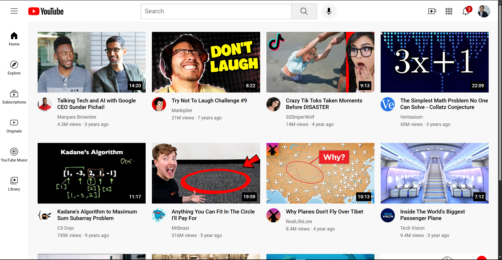

# YouTube.com Clone

This project is a front-end clone of the YouTube homepage built using HTML and CSS. It mimics the layout, design, and basic structure of YouTube's user interface, including a responsive header, sidebar navigation, and video grid.

## 📸 Preview

<-- 
    
-->

## 🛠️ Features

*Header with search bar, voice search, and user action icons.

*Sidebar navigation with popular YouTube sections.

*Responsive video grid layout.

*Tooltips for interactive icons.

*Video preview cards with thumbnails, titles, channels, and stats.

## 🧠 Learnings

This project helped me strengthen my skills in:

-Semantic HTML structuring.

-CSS layout (Flexbox/Grid).

-Modular stylesheet organization.

-Basic responsive design.
